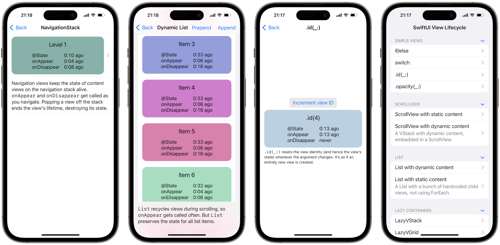
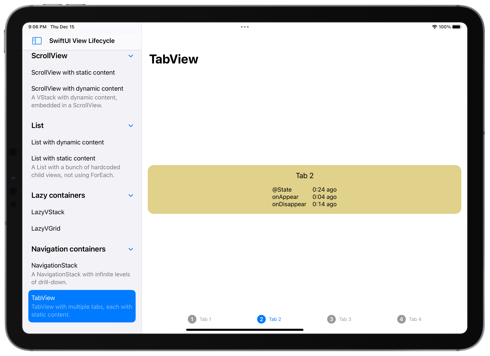
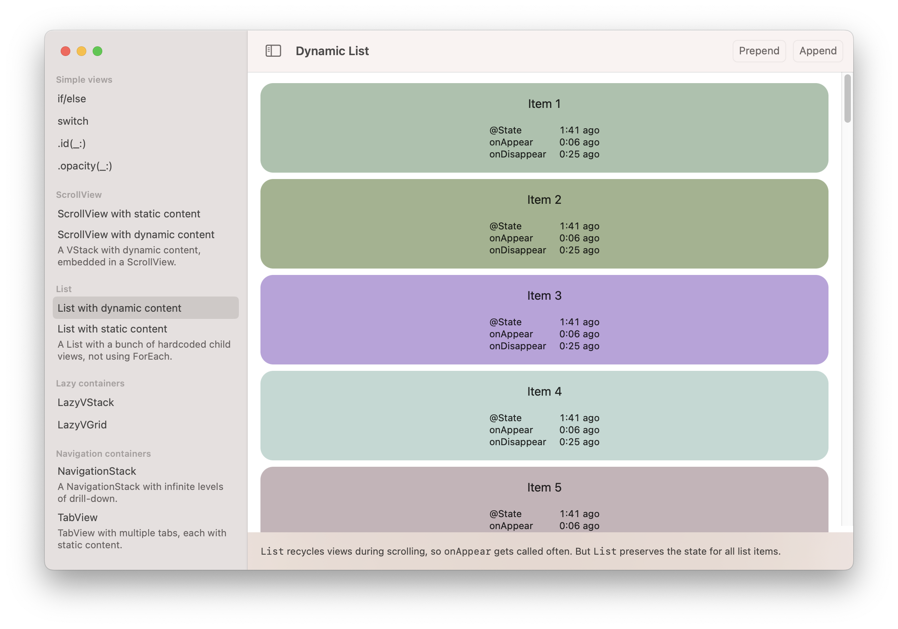
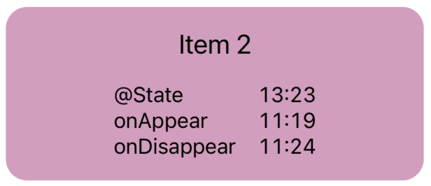

#  SwiftUI View Lifecycle

<https://github.com/ole/swiftui-view-lifecycle>

An iOS and macOS app that demonstrates how different SwiftUI constructs and SwiftUI container views affect:

- the lifetime of `@State`
- the firing of events such as `onAppear` and `onDisappear`

By [Ole Begemann](https://oleb.net), 2022

## Usage

1. Open the project in Xcode.
2. Run the app on the iOS simulator, an iOS device, or on macOS.
3. Click through the list of examples and observe the timestamps when certain lifecycle events happened.

## Requirements

Requires iOS 16 or macOS 13.

## Screenshots

### iPhone

### iPad

### Mac

## The `LifecycleMonitor` view

All examples use one or more [`LifecycleMonitor`](https://github.com/ole/swiftui-view-lifecycle/blob/main/ViewLifecycle/LifecycleMonitor.swift) views as their content. The view below tracks its lifecycle events and displays them as constantly-updating timestamps. For example, this view got created 1:26 minutes ago, which is also when its `@State` got created. Its `.onAppear` and `.onDisappear` actions were last called 15 and 47 seconds ago, respectively:

As you interact with the app, e.g. by scrolling through a `List`, you’ll see these timestamps update (or not, depending on the container view). Pay special attention to resets of the `@State` field because this means that the view got destroyed and recreated, losing all of its internal state.

The view’s background color is set to a random color when its `@State` is created, so color changes are another indication that the view identity has changed.

## License

[MIT license](LICENSE.md)
